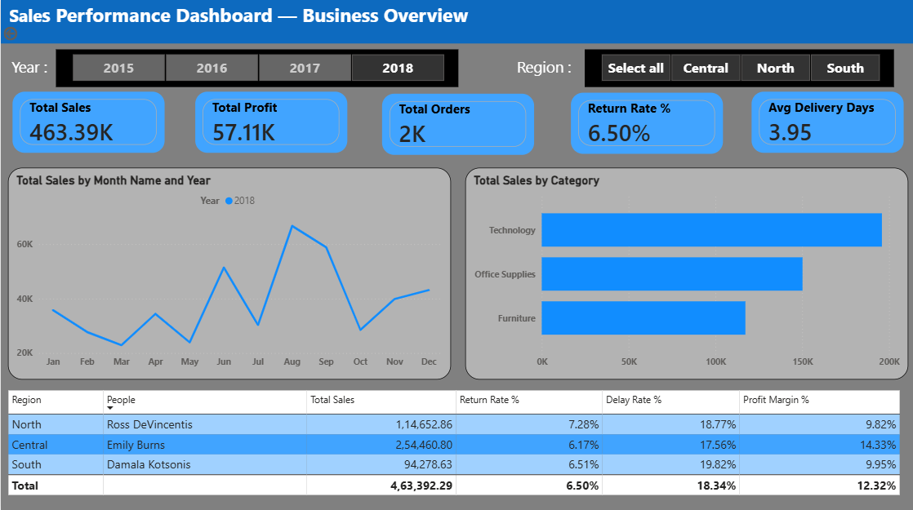
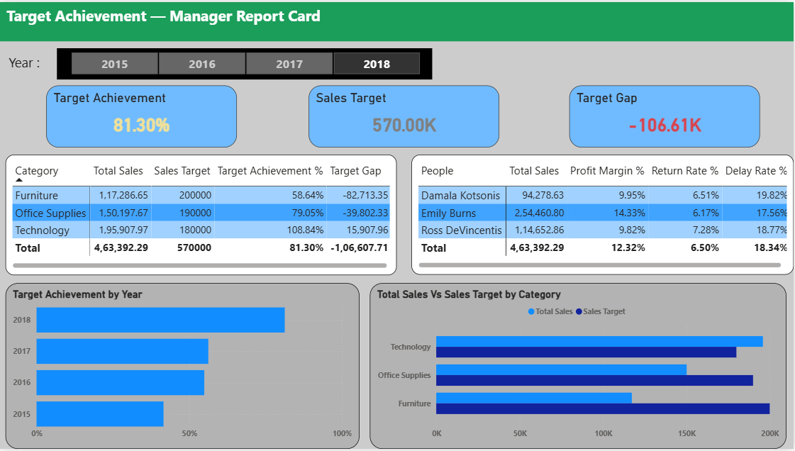
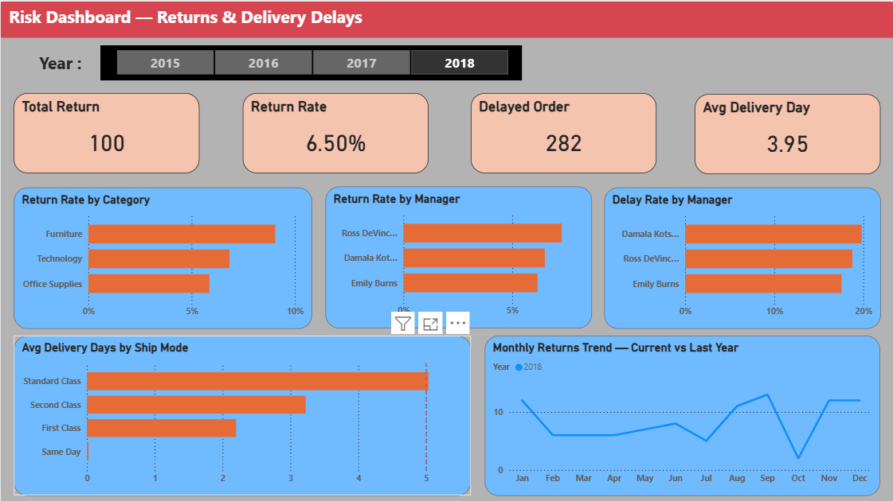

# 📊 Executive Sales Performance Dashboard

A Power BI dashboard designed to help a non-technical Sales Manager conduct monthly business reviews with confidence by transforming complex sales data into clear, actionable business insights.

---

## 📌 Business Problem

A regional sales company was struggling with manual reporting spread across multiple spreadsheets. Leadership lacked visibility into:

- Whether the business was improving year-over-year.
- Which regions were performing well or underperforming.
- Whether Regional Managers were achieving their assigned category targets.
- Which product categories were missing targets.
- Whether product returns were increasing.
- Whether delivery delays were affecting customer satisfaction.
- The key risks and action areas requiring management attention.

The Sales Manager did not have an analytical background and needed a simple, story-driven dashboard rather than a technical report.

---

## 🎯 Project Objective

Build an executive-level Power BI dashboard that enables the Sales Manager to:

- Monitor overall business health.
- Compare current performance with the previous year.
- Track Sales, Profit, Orders, Returns, and Delivery Delays.
- Evaluate Regional Manager performance.
- Analyze category-wise target achievement.
- Identify business risks and improvement opportunities.
- Support monthly leadership review meetings.

---

## 🛠 Tools & Technologies

- Power BI
- DAX
- Power Query
- Microsoft Excel

---

## 📈 Key Business Questions Answered

### Overall Business Performance
- Is the business growing compared to last year?
- Is the growth profitable?
- Are orders increasing or declining?

### Region Performance
- Which regions are performing well?
- Which regions require management attention?

### Regional Manager Performance
- Are Regional Managers achieving their assigned targets?
- Who are the top performers?
- Which managers need support?

### Category Target Achievement
- Which categories are meeting targets?
- Which categories are underperforming?
- Are managers consistently missing targets in specific categories?

### Returns Analysis
- Are product returns increasing or decreasing?
- Which regions or categories contribute most to returns?

### Delivery Performance
- Are delivery delays under control?
- Which shipping methods or regions experience the highest delays?

### Risk Identification
- What are the major risks visible in the business?
- Where should leadership focus immediate action?

---

## 📊 Dashboard Features

### Executive Overview
Provides a snapshot of overall business health using:

- Total Sales
- Total Profit
- Total Orders
- Sales Growth %
- Profit Growth %
- Orders Growth %
- Returns Growth %
- Delivery Delay Growth %

---

### Year-over-Year Analysis

Compare current year performance against the previous year:

- Sales YoY %
- Profit YoY %
- Orders YoY %
- Target Achievement YoY %
- Returns YoY %
- Delivery Delay YoY %

This enables leadership to quickly identify positive and negative trends.

---

### Regional Performance Analysis

Analyze business performance by region:

- Sales by Region
- Profit by Region
- Orders by Region
- Region-wise Growth
- Returns by Region
- Delivery Delays by Region

---

### Regional Manager Performance

Evaluate manager effectiveness through:

- Sales Achievement
- Profit Contribution
- Category-wise Target Achievement
- Overall Performance Ranking
- Underperforming Areas

---

### Category Target Achievement

Understand whether assigned targets are being achieved:

- Sales vs Target
- Target Achievement %
- Category Contribution
- Category Shortfalls
- Manager–Category Mapping

---

### Returns Analysis

Identify areas impacting customer satisfaction:

- Return Trends
- Return Rate Comparison
- Returns by Region
- Returns by Category
- Returns by Regional Manager

---

### Delivery Delay Analysis

Monitor operational efficiency:

- Delayed Orders
- Delay Trends
- Delays by Region
- Delays by Shipping Method
- Delays by Category
- Delays by Manager

---

### Key Risks & Action Areas

The dashboard highlights:

- Regions with declining growth.
- Managers missing targets.
- Categories with high return rates.
- Areas experiencing significant delivery delays.
- Opportunities requiring immediate intervention.

---

## 📷 Dashboard Screenshots

### Executive Overview

---

### Category Target Achievement

---

### Returns Analysis

---

## 💡 Key Insights (Example)

> These insights should be updated based on your dashboard findings.

- The West region showed the highest YoY sales growth.
- Certain Regional Managers exceeded overall targets but missed category-level targets.
- Electronics experienced strong revenue growth but also higher return rates.
- Delivery delays were concentrated within specific shipping methods.
- Returns increased in selected categories, indicating potential service or quality issues.

---

## 📌 Business Impact

This dashboard transformed a manual reporting process into an executive decision-making tool by:

- Improving visibility into business performance.
- Enabling faster monthly reviews.
- Highlighting hidden risks.
- Supporting data-driven decision-making.
- Helping leadership focus on actions rather than data collection.

---

## 🎥 Dashboard Walkthrough

A short presentation explaining the dashboard from a Sales Manager's perspective can be found here:

**Video Link:** [https://drive.google.com/file/d/1wIeSLEdP5cn_8fRcqrWMcnIgSGUJhAS0/view?usp=drive_link]

---

## 👨‍💻 About Me

**Dishank Mahajan**

Aspiring Data Analyst skilled in SQL, Python, Excel, and Power BI with experience in exploratory data analysis, dashboard development, and business insight generation.

- LinkedIn: https://www.linkedin.com/in/dishank-mahajan-5b9433418
---

⭐ If you found this project interesting, feel free to star the repository and connect with me on LinkedIn.
